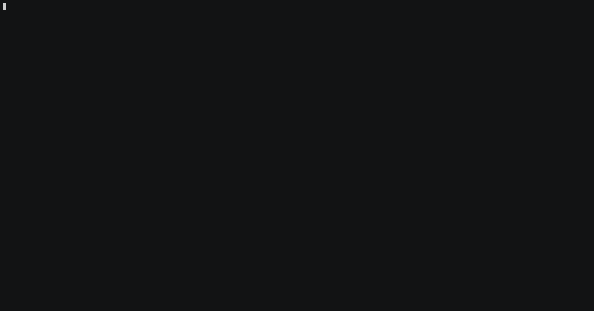

# Brain-games

  

First, you need to install npm. After that run the following command in your terminal.   
`npm install -g brain-games-by-jf`

To start first game  
run **brain-even**

To start second game  
run **brain-calc**

To start third game    
run **brain-gcd**

To start fourth game   
run **brain-progression**

To start fifth game  
run **brain-prime**

